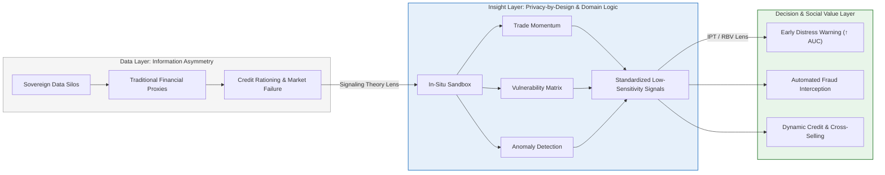

```mermaid
graph LR
    subgraph Context["Data Layer: Information Asymmetry"]
        direction TB
        A["Sovereign Data Silos"] --> B["Traditional Financial Proxies"]
        B --> C["Credit Rationing & Market Failure"]
    end

    subgraph Governance["Insight Layer: Privacy-by-Design & Domain Logic"]
        direction TB
        D["In-Situ Sandbox"] --> E1["Trade Momentum"]
        D --> E2["Vulnerability Matrix"]
        D --> E3["Anomaly Detection"]
        E1 & E2 & E3 --> F["Standardized Low-Sensitivity Signals"]
    end
    
    subgraph Outcomes["Decision & Social Value Layer"]
        direction TB
        G["Early Distress Warning (↑ AUC)"]
        H["Automated Fraud Interception"]
        I["Dynamic Credit & Cross-Selling"]
    end
    
    C -->|"Signaling Theory Lens"| D
    F -->|"IPT / RBV Lens"| G
    F --> H
    F --> I
    
    classDef ctx fill:#f5f5f5,stroke:#999,stroke-width:1px;
    classDef gov fill:#e6f0fa,stroke:#2b78c4,stroke-width:1.5px;
    classDef out fill:#e8f5e9,stroke:#2e7d32,stroke-width:1.5px;
    class Context ctx;
    class Governance gov;
    class Outcomes out;
```